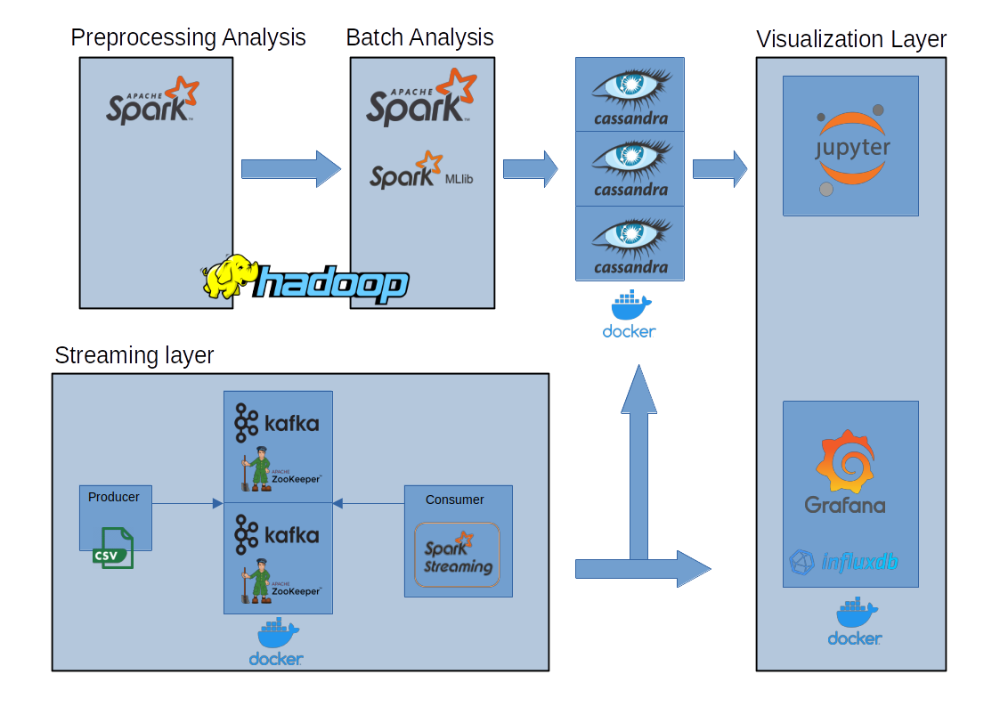
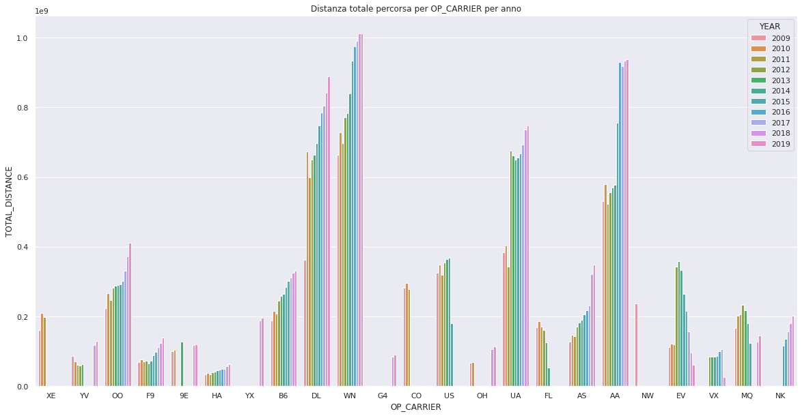
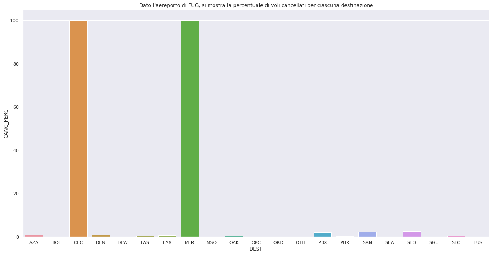
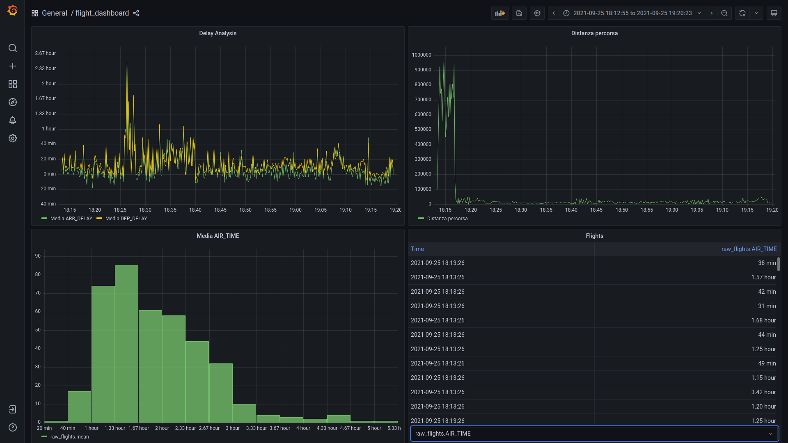

# FlightAnalysis

This project was developed to experiment with a lambda architecture for analyzing domestic flight data in the United States. The dataset includes flights from 2009 to 2020, with various attributes such as destination and arrival airports, scheduled and actual arrival/departure times, waiting times, delays (including reasons), cancellations (including reasons), airline, distance traveled and much more.

Statistical analyses were performed at different time granularities (total, annual, monthly, daily). For instance, the total distance traveled for each airline was calculated. Predictive analyses were conducted using the Apache Spark MLlib library, focusing on predicting flight cancellations and delays. For this purpose, Support Vector Machine (SVM) models were utilized for both flight cancellations and flight delays prediction tasks.

For handling the analysis of the large dataset, Apache Spark was utilized over Hadoop for batch processing. Moreover, Spark Streaming was employed to enable real-time streaming analysis of flight data. To persistently store the data, a combination of Cassandra and InfluxDB was used, with InfluxDB specifically catering to the streaming data storage needs. To facilitate the simulation of real-time data streaming, Apache Kafka was used.

In terms of deployment, Docker was employed to set up and manage clusters, including the Cassandra cluster used for data storage and management. This allowed for easier management and scalability of the infrastructure required for data analysis.

Real-time visualization was achieved through Grafana.

The project was completed as part of the [Big Data](http://torlone.dia.uniroma3.it/bigdata/) course at [Roma Tre University](https://ingegneriacivileinformaticatecnologieaeronautiche.uniroma3.it/) by the authors [Luca Gregori](https://www.linkedin.com/in/l-gregori/) and Alessandro Wood. For detailed analysis results, please refer to the [reports](reports) folder.

## Table of Contents

- [Requirements](#requirements)
   - [Setup Python enviroment](#setup-python-enviroment)
- [Dataset](#dataset)
   - [Acknowledgements](#acknowledgements)
   - [Columns](#columns)
- [Architecture](#architecture)
   - [batch-analysis](#batch-analysis)
   - [cassandra](#cassandra)
   - [kafka](#kafka)
   - [streaming](#streaming)
   - [visualization](#visualization)
- [How to Run](#how-to-run)
- [Results](#results)

## Requirements

In this section, we will discuss the software requirements for the project, including Docker, Python, and other necessary tools.

Used tools:

| Requirement                                                                                       | Docker Image                  | Version     | Description                                                                                                      |
|---------------------------------------------------------------------------------------------------|-------------------------------|-------------|------------------------------------------------------------------------------------------------------------------|
| [Docker](https://docs.docker.com)                                                                 | N/A                           | Latest      | A platform for automating the deployment of applications inside lightweight, portable containers.                |
| [Cassandra](https://cassandra.apache.org/doc/latest/)                                             | bitnami/cassandra             | 4.1.x      | A distributed NoSQL database known for its scalability and fault-tolerance.                                     |
| [Kafka](https://kafka.apache.org/documentation/)                                                 | N/A                           | 5.3.7    | A distributed streaming platform for real-time data processing.                                                  |
| [Spark](https://spark.apache.org/docs/latest/)                                                   | N/A                           |  3.1.2       | A fast and general-purpose distributed computing system for big data analytics.                                   |
| [Hadoop](https://hadoop.apache.org/docs/stable/)                                                 | N/A                           | 3.2.x      | An open-source framework for distributed storage and processing of large datasets.                              |
| [MLlib](https://spark.apache.org/docs/latest/ml-guide.html)                                      | N/A                           | 3.1.2     | A machine learning library provided by Apache Spark for large-scale data processing.                           |
| [Portainer](https://documentation.portainer.io)                                                  | N/A                           | Latest      | An open-source container management tool with a web interface for Docker management.                            |
| [Zookeeper](https://zookeeper.apache.org/)                                                       | confluentinc/cp-zookeeper     | 5.3.7      | A centralized service for maintaining configuration information, naming, and providing distributed synchronization for Kafka. |
| [Grafana](https://grafana.com/docs/grafana/grafana)                                              | grafana/grafana               | 9.1.5      | An open-source analytics and monitoring platform used for real-time data visualization.                         |
| [InfluxDB](https://docs.influxdata.com/influxdb/v1.8/)                                           | influxdb            | 1.8.9       | A time-series database commonly used with Grafana for storing and querying time-series data.                    |

> Please make sure to use the correct Docker images and versions specified in the table in order to run the project.

For all the tools that do not require installation via Docker, it is recommended to follow online guides for the installation process. For instance, to install Spark and Hadoop, you can refer to the following [guide](https://sparkcyclone.io/docs/spark-sql/getting-started/hadoop-and-spark-installation-guide/).

To get started, follow these steps:

1. Clone the repository:
   ```shell
   git clone https://github.com/Lucass97/FlightAnalysis.git
   ```

2. Navigate to the project directory:
   ```shell
   cd FlightAnalysis
   ```

### Setup Python enviroment

Here will be the steps to set up the Python environment correctly:

1. 
   Create and activate a virtual environment (optional but recommended):
   ```shell
   python3 -m venv venv
   source venv/bin/activate
   ```
   > To create a new virtual environment (venv), use the guide at the following [link](https://docs.python.org/3/library/venv.html).

2.
   Install the required dependencies:
   ```shell
   pip install -r requirements.txt
   ```
   > For futher details refer to the [requirements.txt](requirements.txt) file.

## Dataset

The dataset used for this project comprises daily information on domestic flights provided by the largest airlines in the United States. The data covers the period from 2009 to 2020, with each year having a separate CSV file. The dataset was collected and managed by the *"DOT's Bureau of Transportation Statistics"*, focusing on flight delay analysis.

The complete dataset, comprising various CSV files, weighs approximately 9GB and can be obtained from Kaggle using this [link](https://www.kaggle.com/datasets/sherrytp/airline-delay-analysis).

Initially, an attempt was made to preprocess and standardize the dataset for the year 2020. However, unlike the dataset for 2019, even though all the columns were present, the individual records had values that lacked meaning. Unable to deduce a meaningful combination for these records, it was ultimately decided not to include the entire year in the analyses process. As a result, the data for the year 2020 was excluded from further analysis.

### Acknowledgements

The flight delay and cancellation data were collected and managed by the *"DOT's Bureau of Transportation Statistics"*. Only the relevant data for flight delay analysis has been utilized.

### Columns

The dataset contains the following columns:

| Column                | Description                                                                                       |
|-----------------------|---------------------------------------------------------------------------------------------------|
| `FL_DATE`               | Date of the flight in the format yy/mm/dd                                                        |
| `OP_CARRIER`            | Unique identifier of the airline                                                                 |
| `OP_CARRIER_FL_NUM`     | Flight number of the airline                                                                      |
| `ORIGIN`                | Unique code of the departure airport                                                              |
| `DEST`                  | Unique code of the destination airport                                                            |
| `CRS_DEP_TIME`          | Planned departure time                                                                            |
| `DEP_TIME`              | Actual departure time                                                                             |
| `DEP_DELAY`             | Overall delay on departure, expressed in minutes                                                 |
| `TAXI_OUT`              | Time spent between departure from the origin airport and the moment of WHEELS_OFF                 |
| `WHEELS_OFF`            | Instant when the airplane's wheels leave the ground                                               |
| `WHEELS_ON`             | Instant when the airplane's wheels touch the ground                                               |
| `TAXI_IN`               | Time spent between the moment of `WHEELS_ON` and arrival at the destination airport                 |
| `CRS_ARR_TIME`          | Planned arrival time                                                                              |
| `ARR_TIME`              | Actual arrival time                                                                               |
| `ARR_DELAY`             | Overall delay on arrival (negative if early), expressed in minutes                                |
| `CANCELLED`             | Flight canceled (1 = canceled)                                                                    |
| `CANCELLATION_CODE`     | Reason for flight cancellation: A - Airline/Carrier; B - Weather; C - National Air System; D - Security |
| `DIVERTED`              | The airplane landed at an airport different from the destination airport                           |
| `CRS_ELAPSED_TIME`      | Planned flight time                                                                               |
| `ACTUAL_ELAPSED_TIME`   | Actual flight time (`AIR_TIME` + `TAXI_IN` + TAXI_OUT)                                                |
| `AIR_TIME`              | Period during which the airplane is in flight. Time between `WHEELS_OFF` and `WHEELS_ON`               |
| `DISTANCE`              | Distance between the ORIGIN airport and the `DESTINATION` airport                                  |
| `CARRIER_DELAY`         | Delay caused by the airline, expressed in minutes                                                 |
| `WEATHER_DELAY`         | Delay caused by weather conditions                                                                |
| `NAS_DELAY`             | Delay caused by the National Air System                                                           |
| `SECURITY_DELAY`        | Delay caused by security checks                                                                   |
| `LATE_AIRCRAFT_DELAY`   | Delay caused by the late arrival of the aircraft                                                  |
| `Unnamed: 27`           | Unused column (present only in CSV files from 2009 to 2018 and 2020)                              |
| `Unnamed: 20`           | Unused column (present only in 2019.csv)                                                          |

> Please note that in the data preprocessing phase, the inconsistencies in the dataset, including variations in the number of columns, will be addressed to ensure uniformity and consistency for analysis. Fo istance the file 2019.csv contains only 20 columns, unlike the other files. In the data preprocessing chapter, strategies for aligning the dataset will be discussed.

## Architecture

In this chapter, we will explain the architecture used, which is the Lambda architecture.

The Lambda architecture is a data processing design pattern that combines batch processing and stream processing to handle massive amounts of data in a fault-tolerant and scalable manner. The architecture allows for real-time processing of streaming data while ensuring accuracy and completeness in batch processing.

- **Streaming Layer**: This layer utilizes a Kafka cluster and Spark Streaming to perform real-time analysis on "live data." Data streams from various sources are processed in real-time, enabling rapid insights and immediate actions.
- **Batch Layer**: This layer consists of two main phases - data preprocessing and batch analysis. In the preprocessing phase, data is cleaned and transformed before being stored in the Hadoop Distributed File System (HDFS). The complete analysis of the data is then conducted, and the results are saved in the Cassandra cluster. Apache Spark and Spark ML are used extensively in this layer to handle the large-scale batch processing.
- **Visualization Layer**: This layer includes a Jupyter notebook and Grafana. The Jupyter notebook connects to Cassandra using the cassandra-driver connector and visualizes analysis results with graphs and charts. Grafana complements this by providing interactive and user-friendly visualizations for monitoring and exploring the data.



> The Lambda architecture ensures a robust and scalable solution for analyzing large volumes of data, both in real-time and in batch, and provides valuable insights for decision-making and monitoring purposes.

The architecture consists of the following components, divided into different folders/packages:

### [`batch-analysis`](batch-analysis)

This folder contains the necessary code to perform batch analysis, including the following files:

- [batch-analysis/spark-preprocessing.py](batch-analysis/spark-preprocessing.py): Responsible for preprocessing the input dataset. For example, irrelevant columns mentioned in the [Dataset](#dataset) section were removed. As the [Dataset](#dataset) section also mentions that the file `2019.csv` contains only 20 columns, missing columns were derived through feature engineering to make all datasets uniform. For instance, the `ACTUAL_ELAPSED_TIME` column was obtained as follows:
  ```
  ACTUAL_ELAPSED_TIME = AIR_TIME + TAXI_IN + TAXI_OUT
  ```
  Simply put, the total elapsed time is calculated by summing the total airtime with the time between departure and closure of the plane's wheels and the time between opening the plane's wheels and landing. These conclusions were reached by applying preliminary definitions and verifying them using other CSV files.

- [batch-analysis/spark.py](batch-analysis/spark.py): Performs the actual batch analysis using Apache Spark. The analyses are conducted at different time granularities, including total, annual and monthly levels. For example, the following code:
  ```python
  cancellation_diverted_year_month_df = df.select("OP_CARRIER", "FL_DATE", "CANCELLED", "DIVERTED") \
      .withColumn("YEAR", year("FL_DATE")) \
      .withColumn("MONTH", month("FL_DATE")) \
      .groupBy("OP_CARRIER", "YEAR", "MONTH") \
      .agg(count(when(col("CANCELLED") == 1, 1)).alias("CANC_COUNT"), count(when(col("DIVERTED") == 1, 1)).alias("DIV_COUNT"), count("*").alias("COUNT")) \
      .withColumn("DIV_PERC", (col("DIV_COUNT") / col("COUNT") * 100.0)) \
      .withColumn("CANC_PERC", (col("CANC_COUNT") / col("COUNT") * 100.0)) \
      .select("OP_CARRIER", "YEAR", "MONTH", "CANC_PERC", "CANC_COUNT", "DIV_PERC", "DIV_COUNT") \
      .orderBy("YEAR", "MONTH", "OP_CARRIER")
  ```
  calculates the percentage and count of canceled and diverted flights for each airline OP_CARRIER in each month-year pair.

- [batch-analysis/spark-ml.py](batch-analysis/spark-ml.py): Performs predictive analysis using Spark MLlib. The model used for cancellation and delay prediction is a classifier based on the Support Vector Machine algorithm (SVC). Careful attention was given to pre-processing, selecting only relevant features for prediction, and applying techniques like one-hot encoding when appropriate to ensure the SVC performs optimally. Additionally, it's worth noting that the train-test split was set at 85%-15%. Furthermore, feature engineering was performed to obtain a binary value for the delay, where 1 indicates that the flight is delayed, and 0 indicates it's not.

Additionally, the folder contains shell scripts that interact with the `spark-submit` command, specifying the execution mode (local), the number of threads, and the following dependencies:
- `com.datastax.spark:spark-cassandra-connector_2.12:3.1.0`: This dependency enables Spark to interact with Apache Cassandra, facilitating data storage and retrieval.
- `com.github.jnr:jnr-posix:3.1.7`: This dependency provides access to low-level native POSIX functions, allowing Spark to work more efficiently.

---

### [`cassandra`](cassandra)

This package includes all the files needed to set up a 3-node Cassandra cluster. The [cassandra/schema.cql](cassandra/schema.cql) file within this package plays a crucial role in initializing the keyspaces and required tables for data storage and retrieval.

The `StreamingKeyspace` is one of the keyspaces created in Cassandra, using the `SimpleStrategy` replication strategy with a `replication_factor` of 3. This means that the data stored in the `StreamingKeyspace` will be replicated across three nodes in the cluster, ensuring data redundancy and high availability.

The Cassandra cluster is defined within a Docker Compose file located at [cassandra/docker-compose.yml](cassandra/docker-compose.yml). This Docker Compose configuration sets up the 3-node Cassandra cluster and ensures that the database is easily deployable and reproducible.

 >In the [cassandra/docker-compose.yml](cassandra/docker-compose.yml) file for the Cassandra cluster, the absolute paths specified for the volumes section need to be changed to match the local directories on the host machine where the schema and configuration files are located.
>
> For example, if the Cassandra schema file is located in a directory called `cassandra_folder` and the configuration files are in a directory called `cassandra_conf` within the project folder, the volumes section for each Cassandra node should be updated as follows:
> ```yml
> ...
> volumes:
>       - /path/to/project/folder/cassandra_folder/schema.cql:/schema.cql   
>       - /path/to/project/folder/cassandra_conf:/etc/cassandra
> ...
> ```
> By making these changes, Docker will mount the correct directories from the host machine into each Cassandra container, allowing Cassandra to access and use the necessary data and configuration files. This ensures that the Cassandra cluster setup is properly configured and works as intended, with data persistence and high availability across the nodes in the cluster.

The Cassandra layer in this architecture serves the purpose of storing the results related to both Batch Analysis and Streaming Analysis. It acts as the persistent storage layer for the processed and analyzed data, allowing for efficient querying and retrieval of insights when needed.

---

### [`kafka`](kafka)

TThe `kafka` package implements a solution that leverages Apache Kafka, a distributed streaming platform, as part of the Lambda architecture. This package contains the necessary Python code to interact with Kafka, enabling real-time data streaming and processing.

The [kafka/producer.py](kafka/producer.py) script serves as the Kafka producer. It establishes a connection to the Kafka brokers (`kafka-1` and `kafka-2`) defined in the Docker Compose configuration ([kafka/docker-compose.yml](kafka/docker-compose.yml)). Additionally, the Docker Compose configuration includes instances of ZooKeeper, which are essential components for maintaining the coordination and synchronization of the Kafka cluster. The Kafka brokers, along with the ZooKeeper ensemble, form a distributed and fault-tolerant Kafka cluster. This cluster setup allows for high availability and scalability, ensuring the seamless handling of data streams and fault tolerance in case of any node failures within the cluster. 

The producer reads data from the `2019.csv` CSV file, which contains data records, and sends each record to the Kafka topic named `live-data`. Data is sent in batches of 20 elements every 10 seconds. The producer is responsible for simulating the flow of real-time data into the Kafka system.

---

### [`streaming`](streaming)

This package is responsible for consuming the live data generated by the Kafka producer (see [`kafka`](#kafka) section). Its primary purpose is to read and process the flight data messages sent to the Kafka topic `live-data`. It leverages Spark Streaming to handle the real-time data stream effectively.

The flight data processed from the [streaming/spark-streaming.py](streaming/spark-streaming.py) script is stored in both Cassandra and InfluxDB. Cassandra serves as the primary persistent storage layer for storing the processed data and analysis results, ensuring fault tolerance and high availability. Simultaneously, InfluxDB is utilized for specific purposes related to visualization in Grafana.

> To enable the visualization of flight routes and patterns, the flight data undergoes preprocessing steps, with a focus on representing it in a graph format known as `Src-Dest` relationships. The intent was to visualize flight connections and trends effectively. However, this approach was later abandoned due to challenges faced during the implementation.

---

### [`visualization`](visualization)

This package contains the configuration to set up Grafana, including dashboard and datasource settings. Specifically, the configurations are related to InfluxDB.

The [visualization/docker-compose.yml](visualization/docker-compose.yml) file provides the necessary settings for deploying Grafana and InfluxDB. The Grafana user interface is accessible at port 3000 (http://localhost:3000).

> In the docker-compose.yml file, the absolute path specified for the volumes section needs to be changed to match the local directory where the Grafana configuration files are located. Specifically, the path on the host machine should be updated to point to the folder containing the Grafana provisioning configuration files.
>
> For example, if the configuration files are located in a directory called `grafana_config` within the project folder, the volumes section should be updated as follows:
>
> ```yaml
> ...
> volumes:
>  - /path/to/project/folder/grafana_config:/etc/grafana/provisioning/
> ...
> ```
>
> By making this change, Docker will mount the correct directory from the host machine into the Grafana container, allowing Grafana to access and use the necessary configuration files. This ensures that the Grafana setup is properly configured and works as intended.

Please note that Grafana is a powerful data visualization and monitoring tool that allows users to create interactive and customizable dashboards for analyzing various datasets. In this package, the configurations ensure that Grafana is integrated with InfluxDB, allowing it to fetch and visualize the flight data processed and stored in InfluxDB. The dashboard and datasource settings are essential to present the data in a meaningful and user-friendly way within the Grafana environment.

For displaying the results obtained from the batch analysis, you can use the specified [notebook](visualization/batch-analysis.ipynb). The interaction with Cassandra through its respective connector allows you to retrieve the data generated during the analysis, which can then be visualized in the form of graphs. You can modify or expand the contained queries to generate additional charts and visualizations.

## How to Run

In this section, we will explain how to execute the entire project.

1. 
   Download the dataset from the following [link](https://www.kaggle.com/datasets/sherrytp/airline-delay-analysis). Please note that you need to be registered on Kaggle to proceed with the download.

2. 
   Start the DFS daemon.
   ```sh
   chmod +x start-dfs.sh
   ./start-dfs.sh
   ```

3. 
   Prepare the working directories inside the Hadoop Distributed File System (HDFS) and upload the dataset.
   ```sh
   chmod +x upload-dataset-to-hdfs.sh
   ./upload-dataset-to-hdfs.sh
   ```

3.
   Execute the various Docker containers. Specifically, follow the sequence below:
   
   1. 
      Start the Cassandra cluster.
      ```sh
      cd cassandra
      docker compose up -d
      ```
   2. 
      Init cassandra database.
      ```sh
      cd cassandra
      chmod +x create-db.sh
      ./create-db.sh
      ```
   3.
      Launch the Kafka producer, which simulates streaming data generation.
      ```sh
      cd kafka
      docker compose up -d
      ```
   4.
      Start InfluxDB and Grafana for real-time visualization of incoming data.
      ```sh
      cd visualization
      docker compose up -d
      ```

> From this point on, you need to run the corresponding Python scripts for batch analysis and streaming analysis. Note that you must have configured the Python environment, installed all dependencies, and activated the virtual environment (as specified in the [section](#section)).

4. 
   Execute the batch analysis. The process includes pre-processing, data analysis (including statistics), and predictive analysis using Machine Learning models.
   ```sh
   cd batch-analysis
   python3 spark-preprocessing.py
   python3 spark.py
   python3 spark-ml.py
   ```

6.
   Execute the streaming analysis. The user can send a stop signal to terminate the script.
   ```sh
   cd streaming
   python3 spark-streaming.py
   ```

## Results

In this section, some of the results obtained from the analyses conducted are presented. For more detailed information, readers are encouraged to refer to the [notebook](visualization/batch-analysis.ipynb) associated with the batch analysis, the [final report](reports/Final-Report.pdf), and the project's concluding [presentation](reports/Flight-Data-Analysis.pdf).

---


> The image above represents the total distance per flight for each `OP_CARRIER` (i.e., airline) over the years. Although the distance shown is the air distance, it provides a rough estimate of which airlines cover longer distances and may consume more fuel. Additionally, over the years, all airlines have increased their total distance traveled.

---



> The image above depicts the percentage of canceled flights from the `EUG` airport, categorized by destination (`DEST`). It is noteworthy that all flights departing from `EUG` and heading to `CEC` and `MFR` are canceled. In the vast majority of cases, the cancellations are associated with diversions that lead the aircraft to land elsewhere.

---



> The image above displays the Grafana dashboard. Specifically, it shows real-time data for the following:
> - Real-time flight times of just-arrived planes at the airport.
> - The total distance traveled by flights just completed (in real-time).
> - Real-time averages of delays on arrivals and departures of just-arrived planes.

